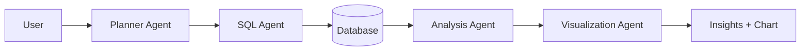

# AI Analyst Agent

🤖 A conversational multi-agent analytics system that transforms natural language questions into SQL queries, executes them against databases, and provides intelligent visualizations and insights.


## ✨ Features

- 🧠 **Natural Language to SQL**: Ask questions in plain English and get accurate SQL queries
- 🎯 **Multi-Agent Architecture**: Specialized agents for planning, SQL generation, analysis, and visualization
- 📊 **Intelligent Visualizations**: Automatic chart type selection with interactive Plotly charts
- 🔄 **Multi-Database Support**: MySQL, PostgreSQL, SQLite, and DuckDB
- 🛠️ **Schema Management**: AI-enhanced table and column descriptions
- 💬 **Conversational Context**: Maintains conversation history for follow-up questions
- 🎨 **Modern UI**: Beautiful Streamlit interface with real-time updates
- 🔄 **Error Recovery**: Automatic SQL error detection and correction

## 🏗️ Architecture

The system uses a LangGraph-based multi-agent architecture where each agent performs a specialized task:



### Agent Workflow

1. **Contextualizer**: Refines user questions with conversational memory
2. **Planner**: Creates analysis strategy and execution plan
3. **SQL Agent**: Generates SQL queries from natural language
4. **Error Fix Agent**: Corrects SQL errors and retries failed queries
5. **Analysis Agent**: Extracts business insights from query results
6. **Visualization Agent**: Creates appropriate charts and visualizations

## 🚀 Quick Start

### Prerequisites

- Python 3.11 or higher
- Groq API key (for LLM functionality)

### Installation

1. **Clone the repository**
   ```bash
   git clone https://github.com/areebakhtar89/ai-analyst-agent.git
   cd ai-analyst-agent
   ```

2. **Create a virtual environment**
   ```bash
   python -m venv venv
   source venv/bin/activate  # On Windows: venv\Scripts\activate
   ```

3. **Install dependencies**
   ```bash
   pip install -r requirements.txt
   ```

4. **Set up environment variables**
   ```bash
   # Create a .env file
   cp .env.example .env
   
   # Edit .env and add your Groq API key
   GROQ_API_KEY=your_groq_api_key_here
   ```

5. **Initialize the database**
   ```bash
   python app/core/init_db.py
   ```

### Running the Application

Start both the backend and frontend services:

```bash
# Terminal 1: Start FastAPI backend
cd app/api
uvicorn main:app --reload --host 0.0.0.0 --port 8000

# Terminal 2: Start Streamlit frontend
cd app/ui
streamlit run app.py --server.port 8501
```

Open your browser and navigate to `http://localhost:8501` to access the application.

## 🗄️ Database Setup

### Default Demo Database

The application comes with a pre-configured DuckDB database containing sample e-commerce data:
- **customers.csv**: Customer information and demographics
- **orders.csv**: Order transactions and metadata
- **order_items.csv**: Line items and product details

### Connecting to Your Database

Use the built-in connection wizard to connect to your own database:

1. Navigate to the "Database Connection" page
2. Select your database type (MySQL, PostgreSQL, SQLite, or DuckDB)
3. Enter connection details
4. Select tables to expose to the AI
5. Add table and column descriptions (optional but recommended)

### Supported Databases

| Database | Connector | Status |
|----------|-----------|---------|
| MySQL | mysql-connector-python | ✅ Full Support |
| PostgreSQL | psycopg2-binary | ✅ Full Support |
| SQLite | Built-in sqlite3 | ✅ Full Support |
| DuckDB | duckdb | ✅ Full Support |

## 📊 Usage Examples

### Basic Queries
- "Show me the top 10 customers by total order amount"
- "What's the average order value by month?"
- "How many orders were placed in each state?"

### Complex Analytics
- "Compare customer demographics between high-value and low-value segments"
- "Identify seasonal trends in product categories"
- "Find customers who haven't ordered in the last 90 days"

### Follow-up Questions
- "Now break that down by region"
- "Show me just the premium customers"
- "What about last year's data?"

## 🛠️ Configuration

### Environment Variables

```bash
# LLM Configuration (Required)
GROQ_API_KEY=your_groq_api_key_here

# Database Connection (Optional - for UI connection)
MYSQL_HOST=localhost
MYSQL_PORT=3306
MYSQL_USER=root
MYSQL_PASSWORD=your_password
MYSQL_DATABASE=olist_db

# PostgreSQL (Optional)
POSTGRES_HOST=localhost
POSTGRES_PORT=5432
POSTGRES_USER=postgres
POSTGRES_PASSWORD=your_password
POSTGRES_DATABASE=database_name

# Kaggle Data Download (Optional)
KAGGLE_USERNAME=your_kaggle_username
KAGGLE_API_KEY=your_kaggle_api_key
```

### LLM Settings

- **Model**: Llama 3.3 70B Versatile (via Groq API)
- **Temperature**: 0.2 (optimized for SQL generation)
- **Max Tokens**: 1500
- **Streaming**: Disabled for agent workflows

## 🧪 Testing

Run the test suite:

```bash
# Run all tests
python -m pytest tests/

# Run specific test modules
python -m pytest tests/test_agent.py
python -m pytest tests/test_graph.py
python -m pytest tests/test_llm.py
```

## 📁 Project Structure

```
ai-analyst-agent/
├── app/
│   ├── agents/                    # Multi-agent system
│   │   ├── analysis.py           # Analysis agent for insights
│   │   ├── contextualizer.py    # Context and memory management
│   │   ├── error_fix_agent.py    # SQL error correction
│   │   ├── graph.py              # LangGraph workflow orchestration
│   │   ├── planner.py            # Query planning and strategy
│   │   ├── sql_agent.py          # SQL generation from NL
│   │   ├── sql_node.py           # SQL execution node
│   │   ├── state.py              # Shared state schema
│   │   └── visualization.py      # Chart generation
│   ├── api/
│   │   └── main.py               # FastAPI backend endpoints
│   ├── core/
│   │   ├── connectors.py         # Multi-database connector layer
│   │   ├── database.py           # Database connection utilities
│   │   ├── llm.py                # LLM client configuration
│   │   ├── schema_metadata.py    # Database schema information
│   │   ├── schema_store.py       # Live schema management
│   │   └── table_retriever.py    # Table and column discovery
│   ├── Scripts/                  # Database setup scripts
│   │   ├── setup_kaggle.py       # Download Olist dataset
│   │   ├── setup_mysql.py        # Create MySQL database
│   │   └── test_connection.py    # Database connection testing
│   ├── tools/
│   │   └── sql_tool.py           # Safe SQL execution tool
│   └── ui/
│       ├── app.py                # Main Streamlit application
│       └── pages/
│           └── connect.py        # Database connection wizard
├── data/                         # Data storage
├── tests/                        # Test suite
├── requirements.txt              # Python dependencies
└── README.md                     # This file
```

## 🔧 API Endpoints

### Core Endpoints
- `GET /` - Health check
- `GET /query/stream` - SSE streaming for real-time progress
- `POST /query` - Standard query endpoint

### Database Management
- `POST /connect` - Establish database connection
- `POST /disconnect` - Close active connection
- `GET /schema` - Retrieve current database schema
- `POST /schema/test` - Test database connection

### Schema Management
- `GET /schema/saved` - List saved configurations
- `POST /schema/load` - Load saved configuration
- `POST /schema/table/select` - Toggle table selection
- `POST /schema/table/describe` - Save table/column descriptions
- `POST /schema/ai/rewrite` - Generate AI-enhanced descriptions

## 🎨 Chart Types

The system automatically selects the most appropriate chart type based on your data:

- **Bar Charts** - Great for categorical comparisons
- **Line Charts** - Perfect for time series and trends
- **Scatter Plots** - Ideal for correlation analysis
- **Pie Charts** - Best for proportional data
- **Area Charts** - Excellent for cumulative trends

## 🔒 Security

- **SQL Injection Prevention**: Parameterized queries and input validation
- **Read-Only Operations**: Blocks destructive SQL commands (DROP, DELETE, UPDATE, INSERT)
- **API Key Management**: Secure environment variable storage
- **Error Sanitization**: User-friendly error messages without sensitive information

## 🚀 Performance

- **In-Memory Sessions**: Fast response times for active conversations
- **Streaming Responses**: Real-time progress updates
- **Efficient SQL Generation**: Optimized query construction
- **Client-Side Chart Rendering**: Reduced server load

## 🤝 Contributing

We welcome contributions! Please see our [Contributing Guidelines](CONTRIBUTING.md) for details.

### Development Workflow

1. Fork the repository
2. Create a feature branch (`git checkout -b feature/amazing-feature`)
3. Commit your changes (`git commit -m 'Add amazing feature'`)
4. Push to the branch (`git push origin feature/amazing-feature`)
5. Open a Pull Request

### Code Standards

- Follow PEP 8 guidelines
- Use type hints consistently
- Add comprehensive docstrings
- Implement proper error handling
- Write tests for new functionality

## 📝 License

This project is licensed under the MIT License - see the [LICENSE](LICENSE) file for details.

## 🆘 Support

### Common Issues

**Q: Getting "API key not found" error**
A: Make sure your `GROQ_API_KEY` is set in the `.env` file

**Q: Database connection fails**
A: Check your database credentials and ensure the database server is running

**Q: Charts not displaying**
A: Ensure you have a stable internet connection for Plotly chart rendering

### Getting Help

- 📖 Check the [Project Documentation](PROJECT_DOCUMENTATION.md)
- 🐛 [Report an Issue](https://github.com/areebakhtar89/ai-analyst-agent/issues)
- 💬 [Start a Discussion](https://github.com/areebakhtar89/ai-analyst-agent/discussions)

## 🗺️ Roadmap

### Upcoming Features

- [ ] Advanced visualization options (heatmaps, treemaps)
- [ ] Custom agent creation framework
- [ ] Export to multiple formats (PDF, Excel, PowerBI)
- [ ] Integration with external data sources (APIs, web scraping)
- [ ] Real-time collaboration features
- [ ] Advanced caching strategies
- [ ] Microservices architecture
- [ ] Container-based deployment

### Technical Improvements

- [ ] Database connection pooling
- [ ] Query result caching
- [ ] Horizontal scaling support
- [ ] Enhanced security with authentication
- [ ] Performance monitoring and metrics

## 📊 Version History

### v2.0.0 (Current)
- ✅ Multi-Database Support (MySQL, PostgreSQL, SQLite, DuckDB)
- ✅ Schema Management System with AI-enhanced descriptions
- ✅ Connection Management UI with 3-step wizard
- ✅ Enhanced API with database and schema endpoints
- ✅ Automated database setup scripts
- ✅ Safe SQL execution framework

### v1.0.0
- ✅ Basic multi-agent architecture
- ✅ Natural language to SQL conversion
- ✅ DuckDB integration
- ✅ Streamlit UI
- ✅ Basic visualizations

---

**Built with ❤️ by the AI Analyst Agent Development Team**

**Last Updated**: March 2026  
**Version**: 2.0.0